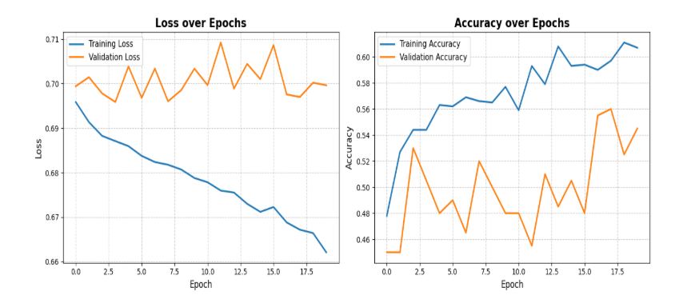

# Mini Project 8: Flood Area Segmentation  
**COMP 9130 – Applied Artificial Intelligence**  
**Natural Disaster Damage Assessment**  

**Group 10** | Due: Beginning of Week 10 | 40 Points

**Project Overview**  
Natural disasters such as floods cause significant damage to infrastructure, agriculture, and communities. Rapid identification of flooded areas is critical for disaster response teams to allocate resources efficiently and plan rescue operations.  

This project applies **semantic segmentation** using the **U-Net architecture** to automatically detect flooded regions in aerial imagery at the pixel level. The model distinguishes flooded water from non-flooded terrain, supporting emergency response and disaster management.  

**Goal**: Build a robust U-Net model (minimum 640×640 resolution) that achieves high mIoU on the Flood Area Segmentation dataset.

**Dataset**  
**Dataset used**: Flood Area Segmentation  
**Source**: Kaggle  
**Link**: [https://www.kaggle.com/datasets/faizalkarim/flood-area-segmentation](https://www.kaggle.com/datasets/faizalkarim/flood-area-segmentation)  

**Characteristics**:  
| Property       | Description                          |  
|----------------|--------------------------------------|  
| Images         | ~290 aerial/UAV images               |  
| Resolution     | ≥ 640×640 pixels                     |  
| Classes        | Binary (Flood / Background)          |  
| Task           | Semantic Segmentation                |  

**Challenges**:  
- Small dataset size → requires strong augmentation  
- Water reflections & muddy areas create visual ambiguity  
- Class imbalance  

**Business Context**: Emergency response teams need rapid flood mapping to prioritize rescue operations and allocate resources.

Install dependencies
pip install -r requirements.txt
How to Run the Code
Recommended: Google Colab (T4 GPU) or VS Code + Colab extension
Option A – Colab (easiest)

Open notebooks/flood_area_segmentation.ipynb in Google Colab
Select Runtime → Change runtime type → T4 GPU
Run all cells in order

Option B – Local / VS Code
Bash# Run training
python src/train.py

# Run evaluation & generate visualizations
python src/evaluate.py
python src/visualization.py
Expected runtime: ~20 epochs on T4 GPU (≈15–25 minutes)
Results Summary
Key Metrics (after 20 epochs):

ClassIoUDiceFlood0.810.89Background0.940.97mIoU0.875-Mean Dice-0.93
Loss Function: Binary Cross-Entropy + Dice Loss
Optimizer: Adam (lr = 0.001)
Callbacks: EarlyStopping + ReduceLROnPlateau
Training Curves and Prediction Examples are shown below.
Sample Predictions
(The model generates input image, ground truth mask, predicted mask, and error map. 6 examples included – good and poor cases)

Team Member Contributions
Tanishq Rawat

Model implementation (U-Net with ResNet34 backbone)
Data preprocessing & pipeline
Training script & callbacks
Metrics calculation

Aristide Kanamugire

Data augmentation strategy
Visualization & error analysis
Report & README preparation
GitHub repository structure

References

Flood Area Segmentation Dataset: Kaggle
Ronneberger et al. (2015). U-Net: Convolutional Networks for Biomedical Image Segmentation. MICCAI.
Segmentation Models library (used for pre-trained ResNet34 encoder)
