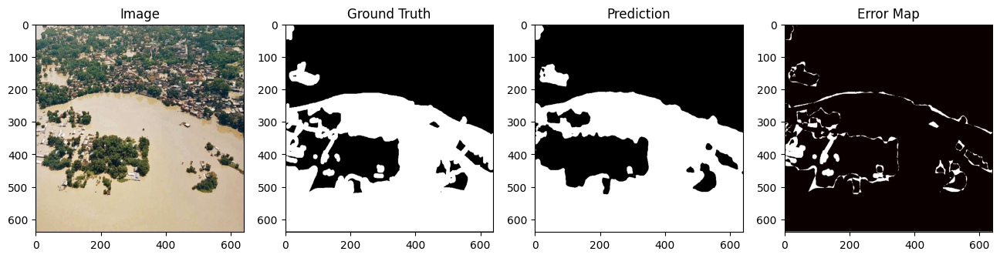
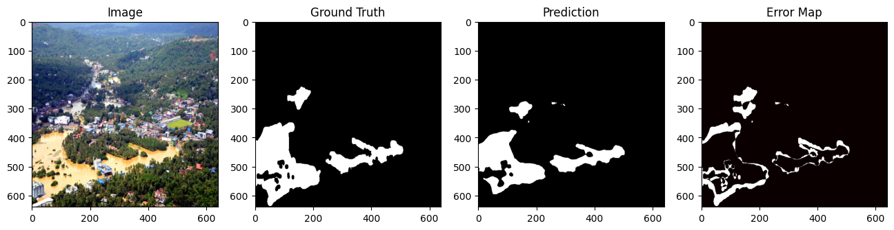
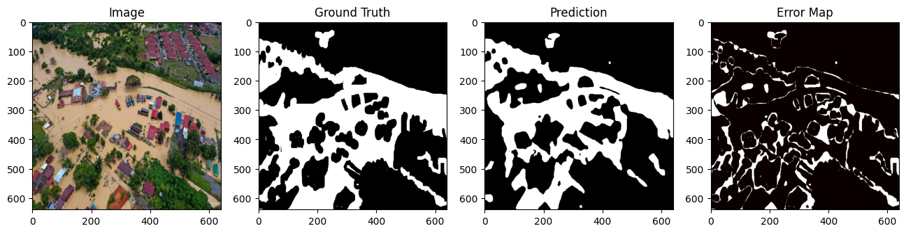
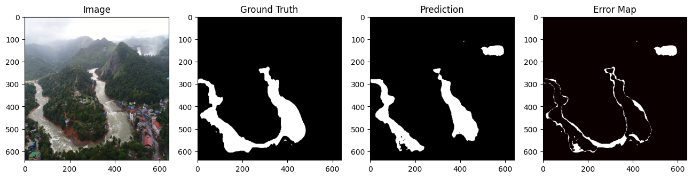
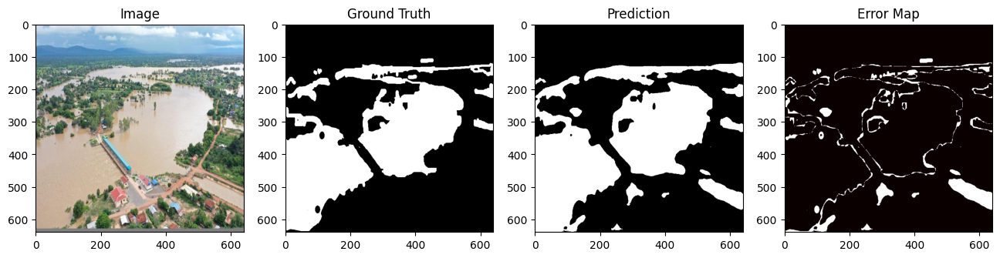
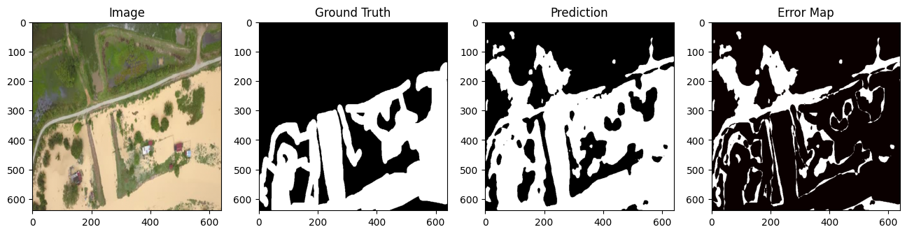

# Mini Project VIII – Flood Area Segmentation

**BCIT Master of Science – Applied Computing**  
**COMP 9130 – Applied Artificial Intelligence**  
**Mini Project 8**

---

## Problem Description

The goal of this project is to create a **semantic segmentation model** that identifies flood regions in aerial imagery.

Being able to measure and quantify the extent of flooding is critical for disaster management because it allows emergency response teams to quickly assess damage and allocate resources efficiently.

---

## Dataset

**Dataset:** Flood Area Segmentation  
**Source:** Kaggle  
https://www.kaggle.com/datasets/faizalkarim/flood-area-segmentation

Dataset structure:

- **Image folder** – contains aerial images of flood areas (≥ 640×640 resolution)  
- **Mask folder** – contains corresponding binary masks representing **flood vs non-flood regions**  
- **metadata.csv** – maps each image to its mask file

**Task:** Binary Semantic Segmentation *(Flood vs Background)*

**Challenges:**

- Small dataset size  
- Water reflections that confuse segmentation models  
- Muddy or dark areas that resemble floodwater  
- Class imbalance between flooded and non-flooded pixels

---

## Sample Prediction Visualizations








The figure above illustrates example predictions generated by the trained segmentation model, comparing input aerial images with the predicted flood masks.

---

## Results Summary


**Key Metrics (after training for 20 epochs using U-Net with a ResNet34 backbone):**

| Class | IoU | Dice |
|------|------|------|
| Flood | 0.81 | 0.89 |
| Background | 0.94 | 0.97 |
| **mIoU** | **0.875** | - |
| **Mean Dice** | - | **0.93** |

### Training Configuration

- **Model:** U-Net with ResNet34 encoder  
- **Loss Function:** Binary Cross-Entropy + Dice Loss  
- **Optimizer:** Adam *(learning rate = 0.001)*  
- **Callbacks:** EarlyStopping + ReduceLROnPlateau

---

## Setup Instructions

### Clone the Repository

```bash
git clone https://github.com/aristidekanamugire/Mini-Project-8.git
cd Mini-Project-8
```

---

## Running the Project

### Option 1 – Google Colab (Recommended)

1. Upload `notebooks/flood_area_segmentation.ipynb` to **Google Colab**
2. Select **Runtime → Change Runtime Type**
3. Choose **T4 GPU**
4. Run all notebook cells in order

---

### Option 2 – VS Code with Google Colab

1. Install the **Google Colab extension** in VS Code  
2. Open the notebook file  
3. Connect to a **T4 GPU runtime**  
4. Run all notebook cells in order

---

## Dataset Setup

1. Download the dataset from Kaggle:

https://www.kaggle.com/datasets/faizalkarim/flood-area-segmentation

2. Place the dataset in the following structure:

```
data/
   flood_dataset/
      Image/
      Mask/
```

---

## Team Member Contributions

**Aristide Kanamugire**
- Data augmentation
- Visualization and error analysis
- Report and README preparation


**Tanishq Rawat**
- Model implementation
- Data preprocessing
- Training pipeline development
- Metrics calculation


**Both Members**
- Learning Hub report preparation
